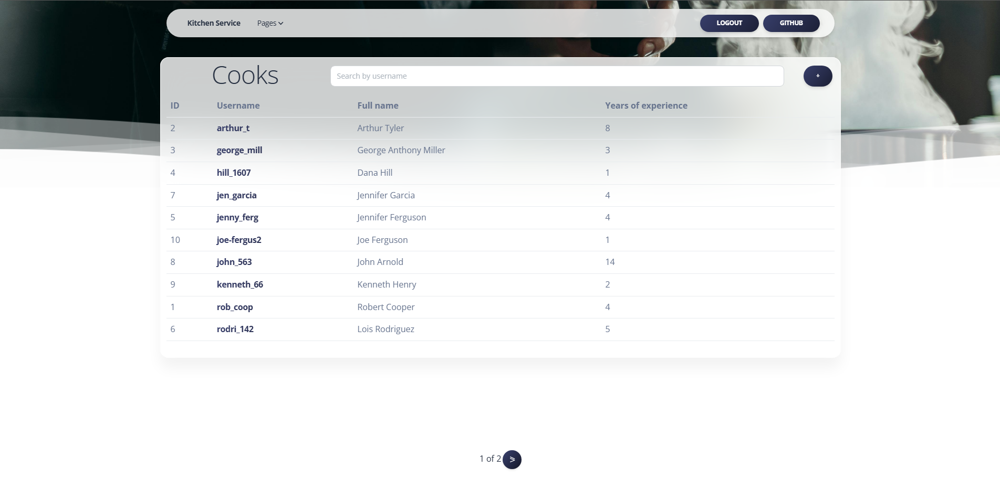

# Restaurant Kitchen Project

Django project for managing dishes and cooks in Restaurant Kitchen

## Installation 

Python3 must be already installed

```shell

git clone https://github.com/DmytroDeviatlytskyi/kitchen-service
cd kitchen_service
python3 -m venv venv
source venv/Scripts/activate
pip install -r requirements.txt
python manage.py runserver
```

Test User:
  - Login: `user`
  - Password: `user12345`


## Features

* Authentication functionality for Cook/User
* Managing dishes cooks ingredients & dish types from website interface

## Demo


